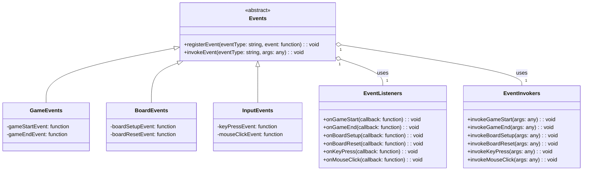

# Introduction  The car game assignment was made to test my abilities to make things work. This summary will be divided into Features Below. 

- Game Setup
- NavMesh And Player Inputs (with event-driven programming)
- Object pooling for AI and Collectables 
- Event-based Explosion spanning 
- Data-Driven Player Stats and Game Configuration 
- UI MVP is a designer-friendly approach.
- Scene Composition to easily add or subtract 


## Game Setup

The game setup was easy. All that was needed to be done was set up the player play area. Put the cars in and ensure the textures are applied, then add them to the prefabs. 

Lastly, setting up the MainCamera to a viable position for gameplay. I like the more isometric view, so I placed it that way.


![[Screenshot 2023-09-06 at 19.21.34.png]]
This is the base of what the end product looks like but the idea is similar. 
Once the setup was done i knew the main model i wanted to push for. 

## NavMesh And Player Inputs 

### Discussing Events System

So when I came to this I wanted it to be as extendable as possible. If needed later we could also shift to the new input system if needed. 

So the criteria for controlling the players and the AI was 
- Isolated Independent systems 
- Singular functionality. 
- Independently testable 
- Debuggable. 

so to start of as I did want to make this fast to be developed I decided to use NavMeh and unities inbuilt systems to get it up and running fast. 

Things we knew we had to do for the player 
- set up the navmesh 
- get the world point from the screen point 
- set the AI's destination. 
- Set up the Rigidbody to make sure we can run them individually. 

So first i needed an input manager sort of class. Initially i was making it so to change waypoints so this class can listen to inputs later. If or when we get the new input systems. 

The overarching design of the Game I wanted to make it so that we can 


![[mermaid-diagram-2023-09-06-185228.png]]


this for me has been really good as once we have this base it can decrease development times and make code really modular. Loosly coupled code can also lead to easy bug fixing but! 
in the end of the day, events are basically loops that can be invoked at anytime. If not made to be asynchronous or not handled well could lead to a lot of overhead. 

In my experience, this has not yet happened as event listeners do not usually exceed a number. Also, if things are clearly labelled 

### Controlling the player
hence we came up with this Events system where we have different events based on different event classes. 

```Csharp
public static class BoardActionsEvents
{
    public static UnityEvent<Vector3> WayPointChangeEvent = new UnityEvent<Vector3>();
}
```


using public static events we know that we can easily allow any listener that needs to know this event happen can do the necessary things. This also allows us to move away from MonoBehivior a little bit cause now we don't need to create a check in Update() to see if the waypoint has changed. now we can simple just invoke the event once an InputProvider calls the event. 

The second major problem we can have is multiple invokers at the same time. Haveing multiple invokers can cause bugs as there will be a lot of systems working on 2 invokes one after the other which can cause the wrong value to be observed. 

In the new InputSystem this means that we can more easily change this code by reading the Vec2 provided by the system. 

The current version is on the old input systems. 


```Csharp
// WaypointManager.cd 
if(Input.GetMouseButtonDown(0))
        {
            Ray ray = mainCamera.ScreenPointToRay(Input.mousePosition);
            RaycastHit hit;
            if (Physics.Raycast(ray, out hit))
            {
                NavMeshHit navMeshHit;
                if (NavMesh.SamplePosition(hit.point, out navMeshHit, 2.0f, NavMesh.AllAreas))
                {
                    BoardActionsEvents.WayPointChangeEvent.Invoke(navMeshHit.position);
                }
            }
        }
```
We have not isolated this code and it can be encapsulated by the new input system without having to do drastic refactoring 

On the player controller side, we have 
```Csharp 
// PlayerController.cs 
public class PlayerController : MonoBehaviour
{
    public NavMeshAgent agent;
    [SerializeField]
    public PlayerStatsData playerStatsData_Model;
    // Start is called before the first frame update
    void Start()
    {
        Debug.Assert(playerStatsData_Model != null, "PlayerStatsData_Model is not assigned in the editor.");

        agent = GetComponent<NavMeshAgent>();
        // reset data when game starts for later. 
        playerStatsData_Model.ResetDataForObservable(); 
        BoardActionsEvents.WayPointChangeEvent.AddListener(OnWayPointChange);
    }
    private void OnDestroy()
    {
        BoardActionsEvents.WayPointChangeEvent.RemoveListener(OnWayPointChange);
    }
    private void OnWayPointChange(Vector3 arg0)
    {
        agent.SetDestination(arg0);
    }
}
```

this logic is not separated. (Again this is the final code I will be coming to the PlayerStatsData on the Data-driven part )

On the AISide at this point, we could do similar things in the AIObject pool. This listens to the AI's Despwan event and then acts accordingly.  

```Csharp 
// AI/AIObjectPool.cs 
{
	//...in Awake 
        AIEvents.DespwnAI.AddListener(OnDespwnAI);
    }

    private void OnDespwnAI(GameObject arg0)
    {
        // Find the AI object in the dictionary and set it to false
        // then set the game object to false
        DisableAI(arg0);
    }

    private void DisableAI(GameObject arg0)
    {
        if (IsAiAliveDictionary.ContainsKey(arg0))
        {
            IsAiAliveDictionary[arg0] = false;
            arg0.SetActive(false);
            _CurrentOnBoard--;
        }
    }
```


![[Screenshot 2023-09-07 at 11.26.43.png]]
Now it was all about setting up the NavMesh area this made sure we can not more easily control AI. 

### AI Spwan locations 

So to have a working spawn locations and have them work properly I decided to set up a AI Spwn position to be on the edges. 

![[Screenshot 2023-09-07 at 12.06.35.png]]

Now, We just made a gizmo for each spawn point this was for 2 reasons 
- A visual representation to know exactly where the AI Cars will spawn and 
- also if we want to increase the number of spawn points or change on based on other play areas. We can just change them around. 
also it helps show that i am willing and capable of making some editor tools #gizmos 

```Csharp 
//DebugInfo/DebugDrawSpwanPosGizmos.cs 
[ExecuteInEditMode]
public class DebugDrawSpwanPosGizmos : MonoBehaviour
{
    GameObject spawnPositionParent;
    Transform[] spawnPositionTransforms;

    void Awake()
    {
        spawnPositionParent = this.gameObject;
        spawnPositionTransforms = spawnPositionParent.GetComponentsInChildren<Transform>();

        foreach (Transform spawnTransform in spawnPositionTransforms)
        {
            if (spawnTransform == spawnPositionParent.transform)
                continue;

            if(spawnTransform.gameObject.GetComponent<DrawSpawnPosGizmos>() == null)
            {
                spawnTransform.gameObject.AddComponent<DrawSpawnPosGizmos>();
            } 
        }
    }
}
```
I also wanted to make a separate script so I can make different types of utilities later. 

## Object pooling for AI and Collectables 

Now, This was made in a slight Hurry, I may have forgotten this exists and work's perfectly with my system as well . Next time we can use the IObjectPool. 
https://docs.unity3d.com/ScriptReference/Pool.ObjectPool_1.html

but for now this works perfectly. So we are good. but ! a stacked implementation that also was more expandable and Enumerable would have been so good! So this part of the system needs a little refactoring 

```Csharp
//AI/AIObjectPool.cs
private IEnumerator SpawnAIObject()
    {
        // wait for 3 seconds   
        yield return new WaitForSeconds(3);
        while (!_StopSpwanEnumirator)
        {
            Shuffle(spawnPostions);
            if (_CurrentOnBoard > m_MaxEnemiesOnBoard)
                yield return null;

            for (int i = 0; i < aiObjectCount; i++)
            {
                var aiAgent = aiObjects[i].GetComponent<AI_Agent>();
                if(_CurrentOnBoard < m_MaxEnemiesOnBoard)
                {
                    if (!IsAiAliveDictionary[aiObjects[i]])
                    {
                        aiAgent.SetStartPoint(spawnPostions[UnityEngine.Random.Range(0, spawnPostions.Length)].position);
                        // look straight ahead
                        aiAgent.transform.LookAt(spawnPostionsParent.transform.position);
                        aiObjects[i].SetActive(true);
                        IsAiAliveDictionary[aiObjects[i]] = true;
                        aiAgent.SetDestination(spawnPostions[UnityEngine.Random.Range(0, spawnPostions.Length)].position, spawnPostionsParent.transform.position);
                        _CurrentOnBoard++;
                    }
                }
                if (IsAiAliveDictionary[aiObjects[i]] && aiAgent.IsAtDestination())
                {
                    // despwan the AI object
                    DisableAI(aiObjects[i]);
                }
                yield return null;
            }
            yield return null;
        }
    }

    void Shuffle(Transform[] array)
    {
        int n = array.Length;
        for (int i = n - 1; i > 0; i--)
        {
            int j = UnityEngine.Random.Range(0, i + 1);
            Transform temp = array[i];
            array[i] = array[j];
            array[j] = temp;
        }
    }
```

I also wanted to use my own way of doing things cause I needed to search which game objects are active and inactive. So a dictionary that will take a reference to the transform. We randomly assign Start and endpoints. 

But there was a problem! the cars would always end up not going through the center or the assignment tends not to go in a good arch so... i decided to Change up the AIAgent.cs class. 
#queuing 
#PossibleFutureSolutions #RoundRobin 


```Csharp 
//AI/AI_Agent.cs 
public class AI_Agent : MonoBehaviour
{
    [SerializeField]
    public PlayerStatsData playerStatsData_Model;
    [SerializeField] private int Impact_Health = 25;
    [SerializeField] private int Impact_Score = 0;
    [SerializeField] private int Impact_Level = 0;
    [SerializeField] private int Impact_Money = 0;


    public NavMeshAgent agent;
    private Queue<Vector3> _path = new Queue<Vector3>();

    private void Awake()
    {
        agent = GetComponent<NavMeshAgent>();
    }
    // should have written this with a queue overload. Still not bad. 
    public void SetDestination(Vector3 destination , Vector3 via)
    {
        _path.Enqueue(destination);
        agent.SetDestination(via);
    }
    public void SetStartPoint(Vector3 startPoint)
    {
        agent.Warp(startPoint);
    }
    public bool IsAtDestination()
    {
        if (agent.remainingDistance <= agent.stoppingDistance)
        {
            if(_path.Count > 0)
            {
                agent.SetDestination(_path.Dequeue());
                return false;
            }
            else
            {
                return true;
            }
        }
        else
        {
            return false;
        }
    }

    private void OnTriggerEnter(Collider other)
    {
        if (other.gameObject.tag == "Player")
        {
            Debug.Log("Player has collected the collectable");
            playerStatsData_Model.stats.Health += Impact_Health;
            playerStatsData_Model.stats.Score += Impact_Score;
            playerStatsData_Model.stats.Level += Impact_Level;
            playerStatsData_Model.stats.Money += Impact_Money;
            playerStatsData_Model.Notify(playerStatsData_Model.stats);

            AIEvents.DespwnAI.Invoke(gameObject);
        }
    }
}
```

### Moment of Truth ... Collectables are not an object pool. 
mainly cause I felt the board was too small for more than 3 things to be there at once. so just what was needed. 

also! i wanted to make a probability-based spawn system later so this was just a temporary thing. 

also! I knew that Y value wouldn't change for now, so I just decided to make it a random point using a Random point in a Unit Circle. 

```Csharp 
    IEnumerator SpwanRandomeLyOnTheLevel()
    {
        yield return new WaitForSeconds(5f);
        while (true)
        {
            if (_currentCollectableOnBoard >= maxCollectableOnBoard)
            {
                yield return new WaitForSeconds(5f);
            }
            else
            {
                int randomeIndex = Random.Range(0, collectables.Length);
                if (!collectables[randomeIndex].activeInHierarchy)
                {
                    Vector2 pointInsideUnitCircle = Random.insideUnitCircle * PlayGroundRadius;
                    collectables[randomeIndex].transform.position = new Vector3(pointInsideUnitCircle.x , this.transform.position.y , pointInsideUnitCircle.y);
                    collectables[randomeIndex].SetActive(true);
                    _currentCollectableOnBoard++;
                }
                yield return new WaitForSeconds(5f);
            }
        }
    }
```

Don't know why I like counters so much. But explicit counters in base-level code do not have magic numbers is something I like. Now we add some particles and some particals and 
![[Screenshot 2023-09-07 at 12.47.43.png]]

I gave money  different colours based on how much money they give you cause... I could not find the real textures in the pack so i thought I'll make do. 
# Event-based Explosion spanning 

ALL RIGHT ! NOW TO GET THE PART I WAS worried about. I don't want to really expand the AI_Agent class making it do 5 different things making it Less SOLID. So this will be .. 

![[Screenshot 2023-09-07 at 12.50.48.png]]
Apparently easier than I thought.  I just had to import Unity's particle pack and set it to destroy after done playing. 

```Csharp 
// This is a bad name .. why did I name it this? 
public class AnimationsController : MonoBehaviour
{
    public GameObject ExplosionPrefab;

    private void Start()
    {
        AIEvents.DespwnAI.AddListener(OnAIDespwan);
    }

    private void OnAIDespwan(GameObject arg0)
    {
        // instantiate the explosation get the play the explosion and then
        GameObject explosion = Instantiate(ExplosionPrefab, arg0.transform.position, Quaternion.identity);
        ParticleSystem system = explosion.GetComponent<ParticleSystem>();
        system.Play();
    }
}
```

Turns out the event-based system was a good idea cause now i could make every system Modular and make it possible to get everything running.

# Data-Driven Player Stats and Game Configuration 
Now! what I usually hate is the inability to have control over information and see who or where can a variable change. 

While I worked for Just Dance we had a lot of Player Stats we needed to deal with we needed to further make things more and more modular and base it on a Scriptable Object that stored everything and made it easy to save but! now i want to implement my favourite way to access data.

## Observables Scriptable Objects 

Now, While I was working on a personal project and a master's project i was doing a lot of full-stack web dev. I have worked with View.js , React.js and currently SvelteKit. There i learnt state-based data management. Where there is a data provider and the data users are notified if the state of the data has changed making sure there is only a single reference of the data but multiple subscribers. 

Also! the most important thing React is hell to work with and just generally is just... I got more done in svelte in 1 day than I could get done in react in a week. Yes, i wanted to take a dig at javascript and React while I was here. 

so! we can have 
- Singular data. 
- Notifiers 
- Data subscribers. 

Also! for now we are only doing player stats now  we are about to come to the player stats which 

```Csharp
// ScriptableObjects/PlayerStatsData.cs
[CreateAssetMenu(fileName = "PlayerStatsData", menuName = "ScriptableObjects/PlayerStatsData")]
public class PlayerStatsData : ScriptableObject, IObservable<PlayerStats>
{
    public PlayerStats stats;
    private List<IObserver<PlayerStats>> observers = new List<IObserver<PlayerStats>>();
    public IDisposable Subscribe(IObserver<PlayerStats> observer)
    {
        if (!observers.Contains(observer))
        {
            observers.Add(observer);
        }
        return new Unsubscriber<PlayerStats>(observers, observer);
    }

    public void Notify(PlayerStats stats)
    {
        foreach (var observer in observers)
        {
            observer.OnNext(stats);
        }
    }

    public void ResetDataForObservable()
    {
        stats.Reset();
    }

    private class Unsubscriber<PlayerStats> : IDisposable
    {
        private List<IObserver<PlayerStats>> _observers;
        private IObserver<PlayerStats> _observer;

        public Unsubscriber(List<IObserver<PlayerStats>> observers, IObserver<PlayerStats> observer)
        {
            this._observers = observers;
            this._observer = observer;
        }

        public void Dispose()
        {
            if (_observer != null && _observers.Contains(_observer))
                _observers.Remove(_observer);
        }
    }
}

```

Thank god for the availability of the IObservervable so this was ... not that bad to write also it has an IObserver as well but for now 

Now we have a way to access and manipulate the data. 
```Csharp
     // Attaching the Scriptable Object as a model to a script 
     // See AI/AI_Agent.cs 
    [SerializeField]
    public PlayerStatsData playerStatsData_Model;
    // then Manipulate or access the data as needed 
    playerStatsData_Model.stats.Health += Impact_Health;
    playerStatsData_Model.stats.Score += Impact_Score;
    playerStatsData_Model.stats.Level += Impact_Level;
    playerStatsData_Model.stats.Money += Impact_Money;
    // Manipulate the data and Notify the changes. 
    playerStatsData_Model.Notify(playerStatsData_Model.stats);

```
But what if we want to know if something has changed? 
```Csharp 
    // See Scripts/UI/Views/HUDView.cs
     // we can mark a class as an IObserver 
	public class HUDview : UIView, IObserver<PlayerStats>, IObserver<GameConfigData>{
	
	// getting the value from 
	public void OnNext(PlayerStats value)
    {
        Debug.Log("Helth: " + value.Health);
        healthBarComponent.value = value.Health;
        if(value.Health <= 0)
        {
            GameEvents.GameOver.Invoke();
            UIEvents.SceneRemoveEvent.Invoke("GameActors",OnGameLossScreenRemoves);
        }
        MoneyLable.text = GetMoneyString_Ink(value.Money);
        
    }
	
	}
```


so making so we don't need much more to worry about in terms of data integrity. it's easy to maintain and now we can also see it change live at one place. 
![[Screenshot 2023-09-07 at 13.28.31.png]]

Now we can easily keep track of and also maintain a configuration. 

NOW! We are going to my favourite part of the whole project

# UI MVP is a designer-friendly approach.

## Goals of this module 
- Easy for UI/UX designers to make upgrades and manage UI without any problem 
- A Controller to control the buttons and view 
- Easy access to data and simple to add and remove and test the UI without playing the whole game. 

How did we accomplish that ? 

firstly a separate scene 
![[Screenshot 2023-09-07 at 13.56.19.png]]
that will only have the UI document. 

We will be using Unity's UXML UI builder so we can easily use CSS and Other Components 

![[Screenshot 2023-09-07 at 13.57.25.png]]
Flexible UI that can is based on flex containers making it easy to work with different components. 

and customizable components to make things work so we can add set remove and even access components. 

like! we can extend the Progress bar to create a HealthBar component like this 
```Csharp 
// See Assets/UI/Componenets/HealthBarComponent.cs 
public class HealthBarComponent : ProgressBar
{
    private VisualElement m_FillVE;
    private void SetBackgrounColort(float value)
    {
        
        m_FillVE = this.Q<VisualElement>(className: "unity-progress-bar__progress");

        if (m_FillVE == null)
            return;

        float r = (value - lowValue) / (highValue - lowValue);

        if (r <= 0.3f)
        {
            m_FillVE.style.backgroundColor = m_LowColor;
        }
        else if (r <= 0.6f)
        {
            m_FillVE.style.backgroundColor = m_MediumColor;
        }
        else
        {
            m_FillVE.style.backgroundColor = m_HighColor;
        }
    }

    private Color m_LowColor; 
    public Color lowColor {
        get { return m_LowColor; }
        set { m_LowColor = value; }
    }

    private Color m_MediumColor;
    public Color mediumColor
    {
        get { return m_MediumColor; }
        set { m_MediumColor = value; }
    }

    private Color m_HighColor;
    public Color highColor
    {
        get { return m_HighColor; }
        set { m_HighColor = value; }
    }

    public override float value
    {
        get { return base.value; }
        set
        {
            base.value = value;
            SetBackgrounColort(value);
        }
    }

    public new class UxmlFactory : UxmlFactory<HealthBarComponent, UxmlTraits> { }
    public new class UxmlTraits : ProgressBar.UxmlTraits
    {
        UxmlColorAttributeDescription m_lowColor = new UxmlColorAttributeDescription { name = "low-color" };
        UxmlColorAttributeDescription m_MediumColor = new UxmlColorAttributeDescription { name = "mid-color" };
        UxmlColorAttributeDescription m_HighColor = new UxmlColorAttributeDescription { name = "high-color" };

        public override void Init(VisualElement ve, IUxmlAttributes bag, CreationContext cc)
        {
            base.Init(ve, bag, cc);
            HealthBarComponent healthBar = (HealthBarComponent)ve;
            healthBar.lowColor = m_lowColor.GetValueFromBag(bag, cc);
            healthBar.mediumColor = m_MediumColor.GetValueFromBag(bag, cc);
            healthBar.highColor = m_HighColor.GetValueFromBag(bag, cc);
        }
    }
}
```

The above allows us to set the progress bar's value based on the value to change and this is not editable on the UI builder as well. 
![[Screenshot 2023-09-07 at 14.01.42.png]]
with now the ability to add different colours. 

## Now for the actual code design. 
for UI one of the best design patterns is the Model View Controller. 

we already have the ability to create models based on scriptable objects. using Observables. 

Now we need to make it so that we can easily add Views. I wanted to do this in the editor. So that the we don't need to add more and more assets to the UIDocument during compile time but we can get it on run time acyncronisly. 

for this first let's create an attribute

### UIAttribute 
#unityAttributes #attributes

```Csharp 
public static class UIViewRegistry
{
    public static Dictionary<string, (Type viewType, string uxmlFilePath)> ViewDictionary = new Dictionary<string, (Type, string)>();
}

[AttributeUsage(AttributeTargets.Class, AllowMultiple = true)]
public class UIViewAttribute : Attribute
{
    public string ViewName { get; private set; }
    public string UXMLFilePath { get; private set; }
    public Type ViewType { get; private set; }
    public UIViewAttribute(string viewName, string uxmlFilePath, Type viewType)
    {
        ViewName = viewName;
        UXMLFilePath = uxmlFilePath;
        ViewType = viewType;
        UIViewRegistry.ViewDictionary.Add(viewName, (viewType, uxmlFilePath));
    }
}
```

we have a static registry to have a single instance of it that can be accessed where necessary. 
we will use a dictionary cause ... Amortized O(1) accesses it pretty good during runtime so we can leave room for other things.  We can make it also so that the dictiornay is created on compile time so at runtime it's not much of an issue. 

let's make it so that the dictionary is created in the editor. 
for now! let's find it in all assemblies in the app domain. We can later constrict it to UI app domain by making it an assemby file for the Assets/UI folder after we namespace it and 
```Csharp 

// now we can in editor just add the Views 
[InitializeOnLoad]
public class UIViewRegistryEditor
{
    static UIViewRegistryEditor()
    {
        RegisterAllViews();
    }

    [MenuItem("Tools/Register All Views")]
    private static void RegisterAllViews()
    {
        UIViewRegistry.ViewDictionary.Clear();

        foreach (var assembly in AppDomain.CurrentDomain.GetAssemblies())
        {
            foreach (var type in assembly.GetTypes())
            {
                var attributes = type.GetCustomAttributes(typeof(UIViewAttribute), true);
                foreach (UIViewAttribute attribute in attributes)
                {
                    if (!UIViewRegistry.ViewDictionary.ContainsKey(attribute.ViewName))
                    {
                        UIViewRegistry.ViewDictionary.Add(attribute.ViewName, (type, attribute.UXMLFilePath));
                    }
                    else
                    {
                        Debug.LogWarning("View with name " + attribute.ViewName + " is already registered.");
                    }

                }
            }
        }

        Debug.Log("All views registered.");
    }
}
```

this gives us every time we save it can load it all but also now we can also do it manually 
![[Screenshot 2023-09-07 at 14.13.48.png]]

now we can write the UIVIew that will be our base class that will be our monobehivior attachment for each view 

```Csharp 
public class UIView : MonoBehaviour
{
    protected VisualElement RootVisualElement { get; private set; }
    // Wied dependency injection .. why not do it via constructor cause i suck
    public void InitializeView(VisualElement rootVisualElement)
    {
        this.RootVisualElement = rootVisualElement;
        OnViewInitialized();
    }

    protected virtual void OnViewInitialized()
    {
        // Can be overridden by subclasses to perform initialization when the view is initialized with the rootVisualElement
    }
}
```

### UI controller there was an attempt to make things asynchronous

so this is how we initialize and assign UIView and The UXML to get and load resources 

so we load up addressables 

```Csharp 
private async Task InitializeUIAsync()
    {
        // Your async code here. For example:
        await ChangeViewAsync(FirstUIView);
    }

    private async Task ChangeViewAsync(string viewKey)
    {
        if (UIViewRegistry.ViewDictionary.TryGetValue(viewKey, out var viewData))
        {
            var rootElement = UIDocument.rootVisualElement;
            rootElement.Clear();
            UIView[] views = gameObject.GetComponents<UIView>();
            foreach (var view in views)
            {
                Destroy(view);
            }

            // Load the UXML asset asynchronously using Addressables
            var uxmlAssetLoadOperation = Addressables.LoadAssetAsync<VisualTreeAsset>(viewData.uxmlFilePath);
            VisualTreeAsset uxmlAsset = await uxmlAssetLoadOperation.Task;

            if (uxmlAsset != null)
            {
                var visualTree = uxmlAsset.CloneTree();
                rootElement.Add(visualTree);

                

                // Instantiate the view script 
                UIView newView = (UIView)gameObject.AddComponent(viewData.viewType);
                // Dependency Injection 
                newView.InitializeView(rootElement);
            }
            else
            {
                Debug.LogError("Failed to load UXML asset: " + viewData.uxmlFilePath);
            }
        }
    }
```

### Had to highlight 
```Csharp 
   // mini dependency injection on initializer 
    newView.InitializeView(rootElement);
```


### finally 
we have 
- Models using Scriptable Objects. 
- Views using UXML and USS. 
- Controllers using attributes UIView components. 

putting it together let's look at the HUD controller 

firstly let's make it a 
```Csharp 
// attribute to the UIView Class to tell the UIDocument which View to import 
[UIView("HUD", "Assets/UI/Views/HUD/HUD.uxml", typeof(HUDview))]
// IObservers to say this class will be overserving data from certain models.
public class HUDview : UIView, IObserver<PlayerStats>, IObserver<GameConfigData>
{
	// Declaring models Subscribers and Unsubscribers.
	public PlayerStatsData playerStatsData_Model = null;
    private IDisposable unsubscriberPlayerData;
    public GameConfig gameConfig_Model = null;
    private IDisposable unsubscriberGameConfig;
    // ... 
    // to access the root component from the UIDocument
    protected override void OnViewInitialized()
    {
	    base.OnViewInitialized();
	    // Getting the model from the object... we can make it more extendable later 
	    playerStatsData_Model = Addressables.LoadAssetAsync<PlayerStatsData>("Assets/Data/PlayerStatsData.asset").WaitForCompletion();
        unsubscriberPlayerData = playerStatsData_Model.Subscribe(this);
        Debug.Log("Helth: " + playerStatsData_Model.stats.Health);
	    // Getting and manipulating UI Objects in the View 
    }
	// Observing the value changes 
    public void OnNext(PlayerStats value)
    {
        Debug.Log("Helth: " + value.Health);
        healthBarComponent.value = value.Health;
        if(value.Health <= 0)
        {
            GameEvents.GameOver.Invoke();
            UIEvents.SceneRemoveEvent.Invoke("GameActors",OnGameLossScreenRemoves);
        }
        MoneyLable.text = GetMoneyString_Ink(value.Money);
        
    }
    // ..... // 

}
```

which gives us a simple 2 scripts 
![[Screenshot 2023-09-07 at 14.36.22.png]]

# Scene Composition to easily add or subtract 

## what do we have? 
- isolated systems. 
- Individual scenes 
- UI systems that are flexible and fast. 
- now let's create a scene management system 

let's create a somewhat asynchronous scene controller.  
```Csharp 
public class SceneController : MonoBehaviour
{
    [SerializeField] private string BaseScene = "BaseScene";
    [SerializeField] private string UIScene = "UIScene";
    [SerializeField] private string GameActors = "GameActors";

    // Start is called before the first frame update
    private void Start()
    {
        StartCoroutine(LoadSceneAsync(UIScene, LoadSceneMode.Additive, () => { Debug.Log("UISceneLoaded"); }));
        UIEvents.SceneAddEvent.AddListener(OnSceneAdd);
        UIEvents.SceneRemoveEvent.AddListener(OnSceneRemove);
    }

    private void OnSceneRemove(string arg0, Action arg1)
    {
        StartCoroutine(UnloadSceneAsync(arg0, arg1));
    }

    private void OnSceneAdd(string arg0, Action arg1)
    {
        StartCoroutine(LoadSceneAsync(arg0, LoadSceneMode.Additive, arg1));
    }

    private IEnumerator LoadSceneAsync(string scene, LoadSceneMode mode, System.Action onComplete = null)
    {
        AsyncOperation asyncOperation = SceneManager.LoadSceneAsync(scene, mode);
        while (!asyncOperation.isDone)
        {
            yield return null;
        }
        onComplete?.Invoke();
    }
    private IEnumerator UnloadSceneAsync(string sceneName, System.Action onComplete = null)
    {
        AsyncOperation asyncOperation = SceneManager.UnloadSceneAsync(sceneName);
        while (!asyncOperation.isDone)
        {
            yield return null;
        }
        onComplete?.Invoke();
    }
}
```

and now we can easily. compose Scenes to load up levels or even compose scenes based on how we want to play or go . 

exmaple1 
```Csharp 
    private void OnPlayButtonClicked()
    {
        UIEvents.SceneAddEvent.Invoke("GameActors" , OnSceneLoaded);
    }

    private void OnSceneLoaded()
    {
        GameEvents.GameStart.Invoke();
        UIEvents.UIChangeEvent.Invoke("HUD");
    }
```

so now we have 3 scenes: one base scene, one that has the UI and one that has the Actors and all we need to do to restart is unload the GameActors and reload it in

![[Screenshot 2023-09-07 at 14.37.38.png]]
